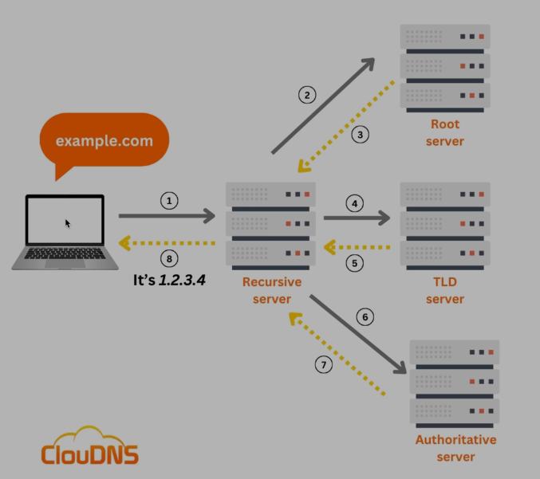

# Internet Working

## IP Address (Internet Protocol) 

ধরেন আপনি আপনার GF/Crush এর কাছে উপহার পাঠাতে চাচ্ছেন,  এখন আপনি যদি উপহার পাঠাতে চান তাহলে  যার কাছে উপহার পাঠাবেন তার address আমার জানতে হবে । 
  
ঠিক তেমনভাবে আমরা যখন একটা কম্পিউটার থেকে আরেকটা কম্পিউটারের সাথে যোগাযোগ করতে চাই বা কাউকে মেসেজ দিতে চাই তাহলেও তো আমরা যে কম্পিউটারে মেসেজ দিতে চাচ্ছি সেই কম্পিউটারের Address আমাদের জানতে হবে । আর এই কম্পিউটারের Address টাকেই বলা হয় IP Address (Internet Protocol) .  

## How To Access Website & Concept Of DNS 

Computer এর এই IP Address টা Permanent নয় , এইটা এক এক সময় এক একটা হতে পারে । আমরা যখন Internet এর সাথে connect হয় তখন এই IP Address change হতে পারে । আর এই IP Address Provide করে ISP (Internent Service Provider) .  
 
computer যখন internet এর সাথে connect হয় ISP (Internet Service Provider) একটা IP Address দেয় আমাদের Device কে Unique ভাবে Identify করার জন্য। 
  
এটা এমন হতে পারে  computer_A কে যে ip address টা দিয়েছে internet service provider (isp) এটা আবার অন্য কোনো computer এ ও দিতে পারে যখন এই computer_a disconnected হয়ে যাবে Internet থেকে। 
  
এখন ধরি আমি একটা website visit করতে চাচ্ছি কিন্তু এই ওয়েবসাইট টা একটা server এ আছে । [Server মানে একটা computer (Virtual Computer)] . এখন সমস্যা হলো আমরা কিছুক্ষন আগে দেখেছি আমরা যদি একটা কম্পিউটার সাথে আরেকটা কম্পিউটারের যোগাযোগ করাতে চাই তাহলে আমাদের ip address এর দরকার হয় (মানে ঐ কম্পিউটার টার Address) ।
  
এখন আমি যে website টা visit করতে চাচ্ছি তার name লিখে আমার browser এ search দিলে কিন্তু চলে আসছে but এটা কিভাবে । আমরা তো ঐ কম্পিউটারের IP Address টা জানি না । সেটা আসে  DNS (Domain Name System) এর থেকে । DNS এ প্রতিটা ওয়েবসাইটের ip address থাকে ।   

আমরা যখন www.programmingHero.com / www.google.come লিখে search/Request  দেই তখন প্রথম DNS এ গিয়ে এই Domain Name গুলোর IP Address খুঁজে বের করে ।  

এখন আমরা যখন এই ওয়েবসাইটের IP Address দিয়ে সার্ভারে request পাঠাবো আর এই সার্ভারটা আমাকে আমার request এ response পাঠাবে এই ওয়েবসাইট টা হিসেবে,  আর অবশেষে website আমার browser এ show করবে  । 

## In Depth Of Dns 

first of all আমরা যখন একটা website search দেই browser এ ,  browser প্রথম check করে এখানে এই website এর IP Address আছে কিনা । 

যদি না থাকে তাহলে তা খুজে Recursive Server এখানেও না থাকলে তা খুজা শুরু করে প্রথম Root Server এ । 

World এ 13 টা Root Server আছে যে Root server আমার ডিভাইসের কাছাকাছি তার কাছে খুজে। Root server Detect করে আমার এই website টা কিধরণের .com নাকি .in । এগুলো Detect করার পর সে পাঠায় Recursive Server এর কাছে। Recursive server  আবার পাঠায় TLD Server এর কাছে । 
  
এখন browser থেকে যে website search দেওয়া হয়েছে সেটা যদি .com হয় তাহলে TLD SERVER এর .com  server  এ খুজা শুরু করে সেও final answer দেয় না  সে  আবার পাঠায় Authoritive Server । then finally found the ip_address your website . 

# Problem In Data Address And Mac Address 

MAC - MEDIA ACCESS CONTROL (Permanent Address)
 
ধরি আমার মোবাইল থেকে আমার ig তে ঢুকে আমার আর আমার ফ্রেণ্ডের মেসেজ দেখার জন্য request পাঠিয়েছি  intagram server এ ।
 
এখন আমরা জানি isp server যে আমাদের ডিভাইসে ip_address টা দেয় সেটা permanent না । 
 
আমাদের ডিভাইস যদি internet থেকে disconnected হয় তখন আমাদের ডিভাইস থেকে isp IP Address  নিয়ে নেয় । 
 
এখন ধরি আমি req পাঠিয়ে দিলাম আর req পাঠানোর moment এ আমার internet disconnected হয়ে গিয়েছে আর আমার এই ip_appdress অন্য কারোর মোবাইলে সেট হয়ে গিয়েছে এখন কি req কি অন্য কারোর মোবাইলে চলে আসবে - **না** 
  
কারন আমাদের ip address permanent না কিন্তু আমাদের প্রত্যেকটা device এ নিজিস্ব mac address আছে সেটা permanent Address আর তা change হয় না এর জন্য request পাঠানোর সময় ip address   + mac address (permanent address ) দিয়ে request পাঠায় আর sender request send করার সময় ip address + mac address দুইটাই পাঠায় তাই এই সমস্যা আমরা face করি না ip_address change হলেও । 

## What Is Port Number 
 
আমরা তো জানলাম আমরা যখন কোন সার্ভারে request পাঠায় তখন তা আমাদের Ip address + Mac Address পাঠায় সার্ভারে । 
 এখন আমি যদি কোন ব্রাউজারের থেকে request পাঠায় আর আমাদের ব্রাউজারে একটা tab এ Instagram আরেকটা তে Youtube server । এখন  সার্ভার যখন আমাদের  ব্রাউজারে request অনুযায়ী reply দিবে তখন সে কি করে বুঝবে browser এ কোন ট্যাবে এই রেকুয়েস্ট টা রান করবো । এর জন্য দরকার হয় port number . আমরা যখন request দেই তখন তা ip_address + mac_address + port number দেয় আর এই port number এর কারনে বুঝতে পারে সার্ভার কোন tab এ run করবে website . 

 # IPv4 Vs IPv6 

আমরা তো জেনেছি আমাদের প্রতিটা Device এ Unique IP Address থাকে। এই IP Address দুই ধরনের হতে পারে 
1. IPv4
2. IPv6
 
**IPv4** যা ৩২ বিটের হয়ে থাকে আর প্রতিটা বিট ০ বা ১ নিতে পারে। যা total ২^৩২ (4.3 Billion)  টা IP Address Generate করতে পারে। কিন্তু বর্তমানে Device মাত্র 4.3 billion এ সীমাবদ্ব নয় এখন আর বেশি Device আছে আর প্রতিটা ডিভাইস এর  যদি একই সময়ে IP Address এর প্রয়োজন হয় তার জন্য তৈরি করা হয়েছে IPV6 যা Total 16 * 8  = 128 bit হতে পারে আর total 2^128 = (340 Undecillion)  unique IP Address generate করতে পারে । 

 
 

## Mac Address 

একটা device এ mac address একটা হয় না । একটা ডিভাইসে যত ভাবে share করার option থাকে তত টা mac address হয়ে থাকে । আমরা যদি ম্যাক এ Terminal এ ifconfig command দেই তাহলে সব mac address এসে যাবে। 

যা ৪৮ বিটের হয় । Hexa-decimal format এ।  

## Port Number 

Port Number ১৬ বিটের হয়ে থাকে যা 2^16 - 35536 টা টোটাল port number generate করতে পারে। 

   
## Local Area Network (Switch & Router) 

ধরি আমাদের কাছে এক কম্পিউটারে (কম্পিউটার A) কিছু তথ্য আছে এবং আমরা চাই সেই তথ্য আরেকটি কম্পিউটারে (কম্পিউটার B) পৌঁছাক। এই দুটি কম্পিউটার একই ঘরে নেই।

কীভাবে সমাধান করব? সবচেয়ে সহজ এবং প্রাথমিক উপায় হলো তথ্যটি  একটি ইউএসবি স্টিকে করে , তবে এটি ধীর এবং বড় পরিসরে কার্যকর নয়। আমাদের একটি সরাসরি, ইলেকট্রনিক সংযোগ প্রয়োজন।

তাহলে আমরা একটি তার (যেমন ইথারনেট ক্যাবল বা ফাইবার অপটিক লাইন) টানি কম্পিউটার A থেকে কম্পিউটার B পর্যন্ত। এখন আমরা সেই তার দিয়ে বৈদ্যুতিক সংকেত বা আলোর পালস পাঠাতে পারি। আমরা একটি সাধারণ কোডে একমত হতে পারি: উচ্চ ভোল্টেজ মানে "১," এবং নিম্ন ভোল্টেজ মানে "০।"

আমরা ঠিক এখনই নেটওয়ার্কের সবচেয়ে প্রাথমিক রূপ তৈরি করেছি: একটি সরাসরি সংযোগ (direct link)। এখন আমরা দুই কম্পিউটারের মধ্যে বিট (১ এবং ০) পাঠাতে পারি।

এটি দুই কম্পিউটারের জন্য কাজ করে। কিন্তু যদি আমাদের তিনটি কম্পিউটার থাকে (A, B এবং C) এবং তারা সবাই একে অপরের সাথে কথা বলতে চায়? তখন আমাদের প্রয়োজন হবে একটি তার A থেকে B, একটি তার B থেকে C, আরেকটি তার A থেকে C। চারটি কম্পিউটারের জন্য ছয়টি তার লাগবে। আর ১০০টি কম্পিউটারের জন্য লাগবে ৪,৯৫০টি তার।

এটি একটি বিস্তারজনিত ব্যর্থতা। প্রতিটি মেশিনকে সরাসরি অন্য প্রতিটি মেশিনের সাথে যুক্ত করা শারীরিকভাবে অসম্ভব।

এর যৌক্তিক সমাধান হলো একটি কেন্দ্রীয় ডিভাইস রাখা। প্রতিটি কম্পিউটার সেই এক কেন্দ্রীয় বিন্দুর সাথে যুক্ত থাকবে (এটিকে আমরা বলি **switch**)। যখন কম্পিউটার A কম্পিউটার C-এর সাথে কথা বলতে চায়, তখন এটি বার্তাটি সুইচে পাঠায়, আর **switch** সেটি কেবল কম্পিউটার C-তে ফরওয়ার্ড করে।

আমরা ঠিক এখনই আবিষ্কার করেছি একটি লোকাল নেটওয়ার্ক। কাছাকাছি অবস্থানে থাকা একদল কম্পিউটার (যেমন একটি অফিস বা বাড়ি) এখন দক্ষভাবে যোগাযোগ করতে পারে।

এখন আমাদের অফিসে একটি লোকাল নেটওয়ার্ক আছে। শহরের অন্য প্রান্তে আরেকটি অফিসেরও নিজস্ব লোকাল নেটওয়ার্ক আছে। কিভাবে আমাদের নেটওয়ার্কের একটি কম্পিউটার তাদের নেটওয়ার্কের একটি কম্পিউটারের সাথে কথা বলবে?

আমরা একই বিস্তারজনিত সমস্যার মুখোমুখি হই। আমাদের অফিসের প্রতিটি কম্পিউটার থেকে তাদের অফিসের প্রতিটি কম্পিউটারে সরাসরি তার টানা সম্ভব নয়।

এর যৌক্তিক সমাধান হলো নেটওয়ার্কগুলোকেই পরস্পরের সাথে যুক্ত করা। আমাদের একটি বিশেষ ধরনের কম্পিউটার দরকার, যা আমাদের নেটওয়ার্কের সাথে যুক্ত থাকবে এবং তাদের নেটওয়ার্কের সাথেও যুক্ত থাকবে। এর একমাত্র কাজ হবে বার্তা বা "ট্রাফিক" এক নেটওয়ার্ক থেকে অন্য নেটওয়ার্কে পাঠানো বা রাউট  করা। একে বলা হয় একটি **Router**।

এখন যদি আমরা তৃতীয় একটি নেটওয়ার্কে যুক্ত হতে চাই, তাহলে আমাদের রাউটারকে তাদের রাউটারের সাথে যুক্ত করলেই হবে। ধীরে ধীরে আমরা অসংখ্য নেটওয়ার্ককে একে অপরের সাথে যুক্ত করে একটি বিশাল জাল তৈরি করতে পারি।

ইন্টারনেট হলো "নেটওয়ার্কের নেটওয়ার্ক।" এটি কোনো একক বিশাল মেঘ নয়; বরং এটি হলো কোটি কোটি ব্যক্তিগত এবং সরকারি লোকাল নেটওয়ার্ক, যা এই বিশেষ রাউটিং ডিভাইসগুলোর মাধ্যমে পরস্পরের সাথে যুক্ত।

## Modern Router 

আচ্ছা আমাদের বাসার মধ্যে যে Router গুলো আছে এগুলোর মধ্যে তো আমরা কোনোদিন Switch দেখিই নাই । কিন্তু এগুলোতেও switch আছে । আচ্ছা switch যদি থেকেই থাকে তাহলে আমরা কি করে wireless ভাবে কাজ করতে পারছি এইটা জন্য আমাদের help করতেছে  WAC (wireless access control )। 

