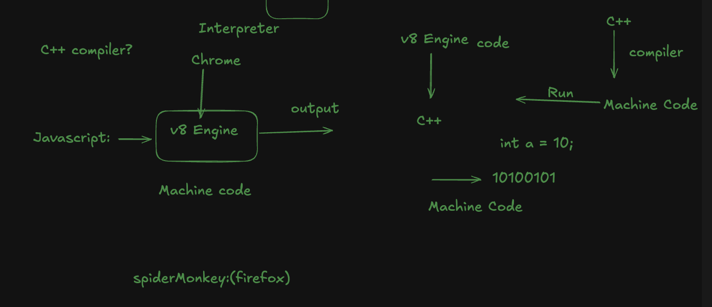

# INTRODUCTION TO JAVASCRIPT

Brendan Eich 1995 সালে মাত্র **১০ দিনে** javascript তৈরি করেছিল । 

আচ্ছা জাভাস্ক্রিপ্ট এর আগে তো আরো programming language তো ছিল তাহলে কেন আবার নতুন করে language এর দরকার হয় । 

**1. Ease of learning Webdeveloper**
HTML ও CSS যেমন lightweight , forgiving Type এর . 
HTML ও CSS এর মতো JavaScript-ও তুলনামূলকভাবে forgiving । সেমিকোলন না দিলে সাধারণত বড় সমস্যা হয় না। 
```js 
console.log("Hello....")
```

**2. Massive Security Nightmare:** 

c++ এর অনেক সুবিধা আছে এইটা অনেক ফাস্ট কিন্তু আমরা জানি **Low Level Language** আর 
low-level হওয়ায় সিস্টেম-লেভেল অ্যাকসেস করতে পারে যেমন (ফাইল পড়তে পারে , নেটওয়ার্ক, সিস্টেম কল ইত্যাদি)
- File system access 

```c++ 
#include <fstream>
std::ofstream file("C:\\Users\\rohit\\secrets.txt");
file << "stolen data";
```
স্যান্ডবক্সিং না থাকলে, এই কোডটি আমার কম্পিউটারের যেকোনো ফাইল পড়তে, লিখতে বা মুছে ফেলতে পারবে।
তাই একটি স্যান্ডবক্সযুক্ত পরিবেশে, আমাকে সমস্ত ফাইল ইনপুট/আউটপুট (I/O) কল আটকাতে হবে এবং সেগুলো হয় ব্লক করতে হবে, নয়তো একটি নিরাপদ “ভার্চুয়াল” ফাইল সিস্টেমে সীমাবদ্ধ রাখতে হবে।

এখন প্রশ্ন জাগতে পারে sandoxing কি  
**Sandboxing মানে হলো** — কোনো প্রোগ্রাম বা কোডকে একটা নিরাপদ, সীমিত ঘেরার (sandbox) মধ্যে চালানো, যাতে সে তোমার আসল সিস্টেমে (যেমন ফাইল, নেটওয়ার্ক, মেমোরি ইত্যাদি) ক্ষতি করতে না পারে

- System call
```cpp
#include <cstdlib>
system("rm -rf /");   // Linux
system("format C:");
```

raw c++ code function এর মাধ্যমে সরাসরি **operating system** command চালাতে পারে । 

- Direct memory access (pointers)
- Networking
```cpp
#include <sys/socket.h>
connect(...); // Open a raw socket to exfiltrate data
```


**3.Automatic Garbage Collection** 

c++ এ একটা memory block create হলে তা Delete করার জন্য আমাদের **new delete** লিখতে হয় এখানে automatic garbage করা যায় না ফলে memory leak হয়। 

আর js এ ডেভেলপারদেরকে ম্যানুয়ালি মেমরি অ্যালোকেট (allocate) বা ফ্রি (free) করতে হয় না।
জাভাস্ক্রিপ্ট ইঞ্জিন নিজেই এই কাজগুলো করে ফেলে, যার ফলে কোড লেখা সহজ হয় এবং অনেক সাধারণ বাগ — যেমন মেমরি লিক (memory leak), যা C++-এর মতো ভাষায় ম্যানুয়াল মেমরি ম্যানেজমেন্টে দেখা যায় — তা থেকে রক্ষা পাওয়া যায়।


memory leak কি - 

কোন program যখন কোন **memory use** করে পরে এটি **system** কে ফিরিয়ে দেয় না বা release/free করে না , ফলে system memory কমতে থাকে . 

js এই memory leak হয় না কারণ js এ এই garbage collector automatic হয়ে থাকে। 


**4. Ligthweight Design or Limited system resource**

আমরা জানি c++ run করার জন্য compiler এর দরকার হয় কিন্তু 1995 সালে আমাদের computer এর ram এর সাইজ খুবই সীমিত  ছিল **(4MB to 8MB RAM)** , **Hard Disc ছিল common size (100-500 MB) & Higher End Pc (1GB )** আর **cpu Intel primium 75–133 MH.**  

একটি sandboxed C++ runtime চালাতে প্রচুর RAM ও CPU ব্যবহার হয়ে যেত — এটা তখন অসম্ভব ছিল, কারণ সেই সময় মোটে ৮ MB RAM থাকত, যা Windows 95 আর ব্রাউজার—দু’টির মধ্যেই ভাগ হয়ে যেত।

হার্ড ডিস্কগুলো ছিল ছোট এবং ধীরগতির, তাই বড় runtime environment বা ভারী লাইব্রেরি রাখার জায়গা ছিল না।

ব্রাউজারগুলোকে হালকা (lightweight) রাখতে হতো, নয়তো মানুষ সেগুলো ব্যবহারই করত না।


###### How to run javascript 

ব্রাউজারে JavaScript চালাতে জাভাস্ক্রিপ্ট ইঞ্জিন লাগে Chrome এ V8, Firefox এ SpiderMonkey ইত্যাদি। 
আর এই **v8 engine** টা  নাকি c++ দিয়ে create করা। 

এইটা জানার পরে আমার মনে প্রশ্ন জেগেছিল এইটা যদি c++ দিয়ে create করা হয়েই থাকে তাহলে তো Compiler এর দরকার হবে কিন্তু বিষয় টা এমন না , v8 engine এ compiler এর দরকার হয় না কারণ এই c++ code (টা যেটা input হিসেবে js এর code কে নেয়) already machine code এ convert করা। 

এখন আমরা জানি c++ এর কোড system control করতে পারে কিন্তু এখানে v8 engine এই system control অপশনটা কে সীমাবদ্ব থাকে ।

###### JIT (Just-In-Time)
V8 একটি ইন্টারপ্রেটার + JIT কম্পাইলার ব্যবহার করে - 

১ম কোডটি ইন্টারপ্রেট করা হয় ( line-by-line/bytecode ) হিসেবে চলতে পারে।
পরে যখন কোনো অংশ বারবার চালায় (same code), V8 তা JIT করে মেশিন কোডে কম্পাইল করে ফলে পরবর্তীতে দ্রুত চলে।
**JIT হলে কিভাবে নিরাপদ থাকে?** কারণ V8 নিজেই sandbox বজায় রাখে — V8 যে মেশিন কোড তৈরি করে তাও JS-র কন্টেক্সট (রানটাইম) সীমাবদ্ধ রাখে,  ব্রাউজারের নিরাপত্তা নীতিগুলো (কোর্স, permission, API restrictions) বহাল থাকে।


##### অপারেটিং সিস্টেম (OS) নির্ভরতা

আচ্ছা আমরা আরেকটা জিনিস দেখেছি আমরা যখন chrome download করি তখন আমাদের কে show করে আমরা কোন **Operating system** এর জন্য download করতে চাচ্ছি তারপর জানতে চাই আমাদের operating system ৩২ বিট নাকি ৬৪ বিট। এটার কারণ হলো এই v8 engine এর machine code . কারণ আমরা জানি **c++** হলো **machine dependent** programming language . আর windows এর machine code macos বুঝবে না আর macos এর machine code linux বুঝবে না তাই আমার chrome download করার আগে জানতে চাই আমরা কোন os এর জন্য download করতে চাচ্ছি। 

