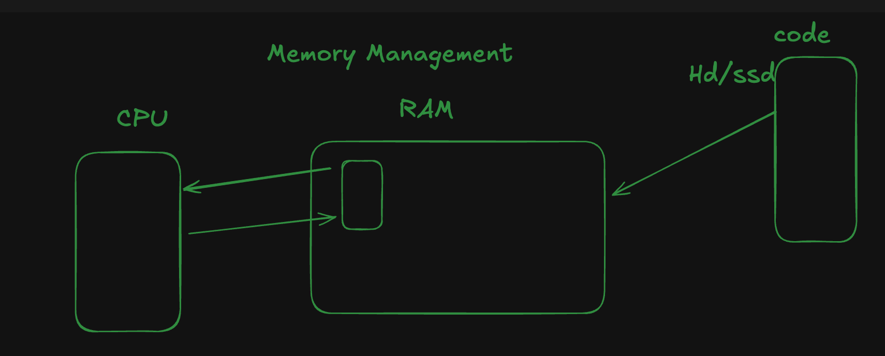
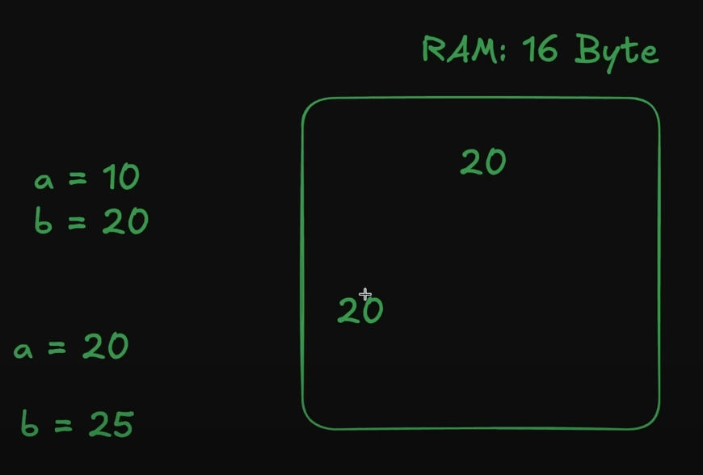
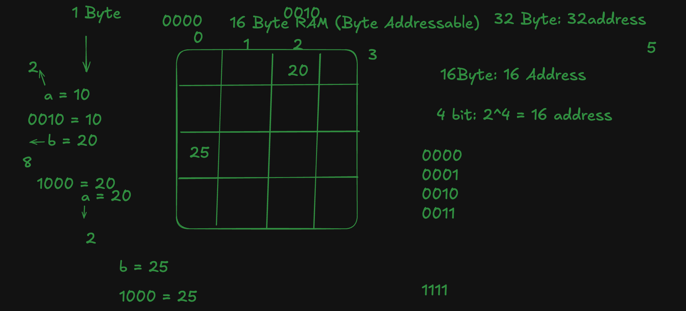
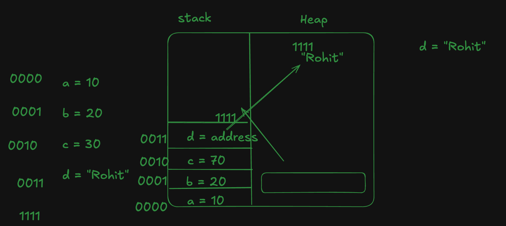
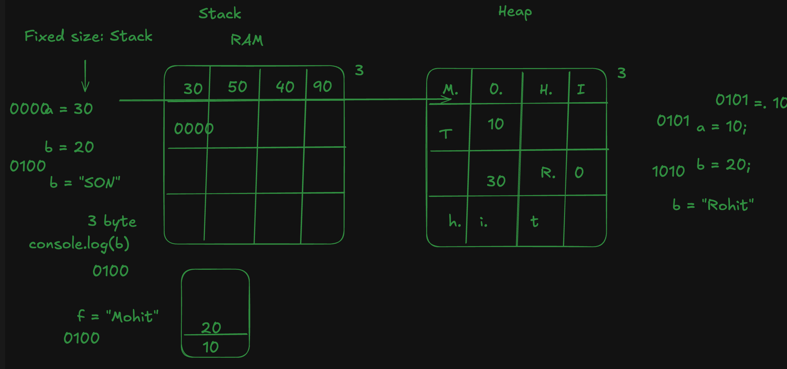

### RAM, Hard Disk, and CPU Interaction  

একটা গেইম যখন আমরা Download করি তখন তা SSD / Hard disc এ থাকে । 
আমরা যখন রান করি তখন তা RAM (Random Access Memory) তে আসে তারপর তা CPU তে যায় এবং রান হয় । 
SSD থেকে সরাসরি CPU তে আসে না কারণ এতে প্রসেস অনেক slow হয়ে যেত । 
RAM - Temporary Storage 
HARD DISC - Permanent Storage

## Problem Statement: Managing Data Without Unique Identifiers  

ধরি আমরা মেমোরি তে a = 20 আর b = 20 দিয়ে দিলাম আর এখন যদি b = 25 করি তাহলে এই মেমোরি কিভাবে বুজবে কোন 20 value কে পরিবর্তন করবো । 
তাই এর জন্য দরকার হয় Address যা মেমোরি কে unique Indentify করে । 

## Solution: Byte-Addressable Memory  

Byte Addressable মানে প্রতিটা Byte block কে Byte Address দিয়ে দিবো যাতে প্রতিটা block কে uniquely Addressable করতে পারি  । 

প্রতিটা ভ্যারিয়েবল uniquely address এ initialize হয়ে সেভ হয় RAM এর মধ্যে । 

## Introduction to Stack & Heap Memory  

## Why Need Stack & Heap both ? 

## Fixed vs Dynamic Data Allocation  